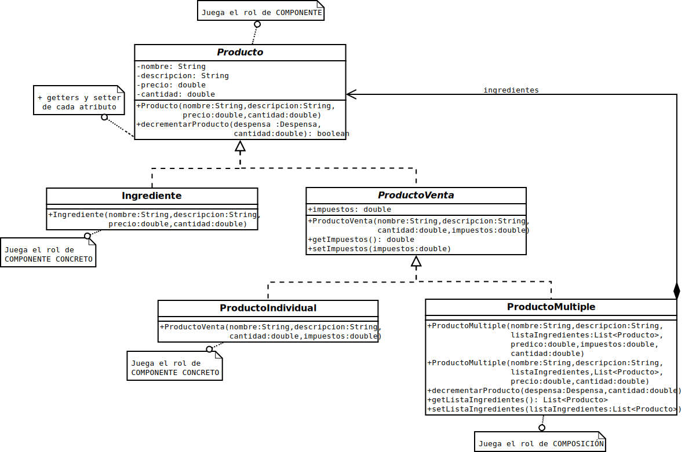
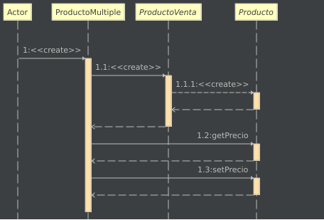
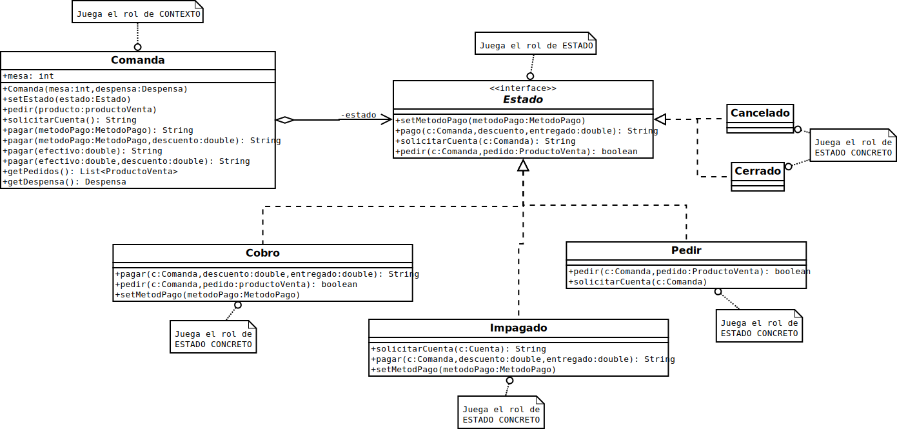
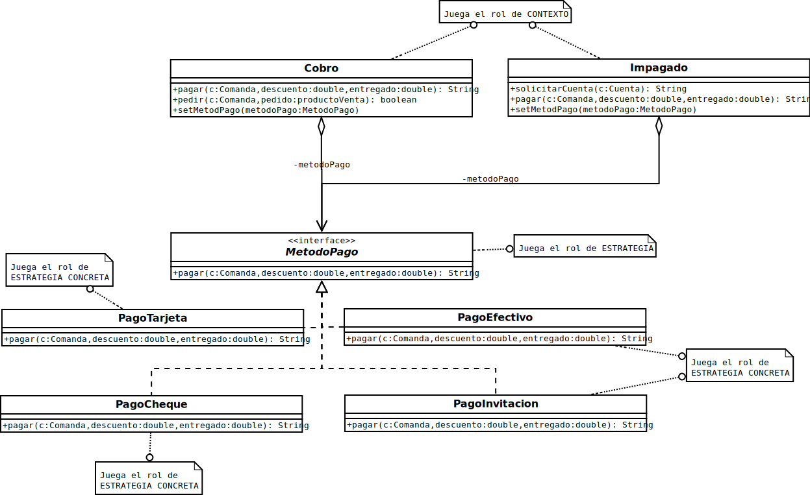
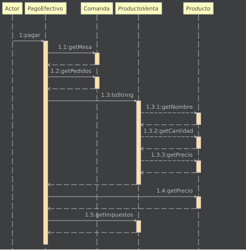

# Principios de Diseño
## Responsabilidad única
Sigo el principio de responsabilidad única en varias ocasiones, para los métodos de pago por ejemplo, donde su única responsabilidad es crear la factura simplificada correspondiente, o en la clase Despensa, que su única responsabilidad es almacenar y administrar el stock de productos.
## Abierto-Cerrado
Sigo este principio en la clase despensa, para decrementar las existencias de un producto, dicha función se delega en el producto, siendo esto diferente si fuera un producto individual o múltiple o un nuevo tipo de producto. También lo sigo en la clase Comanda, donde delego todos los métodos a la clase Estado. 
## Sustitución de Liskov 
Este principio lo sigo para el uso de los métodos de pago, donde puedes pagar de múltiples formas cambiando la clase que implementa MetodoPago.
## Inversión de dependencia 
La inversión de dependencia la sigo tanto para los métodos de pago como para los estados de la comanda y para los productos.
Por ejemplo a la hora de hacer la lista de productos en la clase Despensa, se guardan Productos, y no un tipo concreto de ellos.
## Encapsula lo que varía
Sigo este principio para los estados de Comanda y para los métodos de pago, siendo estas las partes más subceptibles a variar en el futuro, añadiendo nuevos métodos de pago o estados de la comanda. 

# Patrones de Diseño

## Patrón Composición
Usé este patrón para representar los tipos de **Producto** \\
Ya que los productos pueden ser individuales o múltiples y los múltiples contienen una lista de productos, el patrón composición es perfecto
### Diagrama de clases

### Diagrama dinámico de secuencia 

## Patrón Estado
Usé este patrón para representar las diferentes fases de la **Comanda** \\
Trato a las diferentes fases de una comanda como *Estados* en los que se puede encontrar, derivando los métodos a la interfaz **Estado** que actuará diferente dependiendo de su implementación (si está en fase de cobro, pedir, etc.)
### Diagrama de clases

### Diagrama dinámico de estados 

## Patrón Estrategia
Usé este patrón para los diferentes tipos de **Metodo de pago** \\
Para seguir el principio de encapsular lo que varía y responsabilidad única, separo el método de pago en una interfaz que permite variar el método o crear núevas formas de pago sin modificar el código de todos los *estados* que lo implementan.
### Diagrama de clases

### Diagrama dinámico de secuencia 

